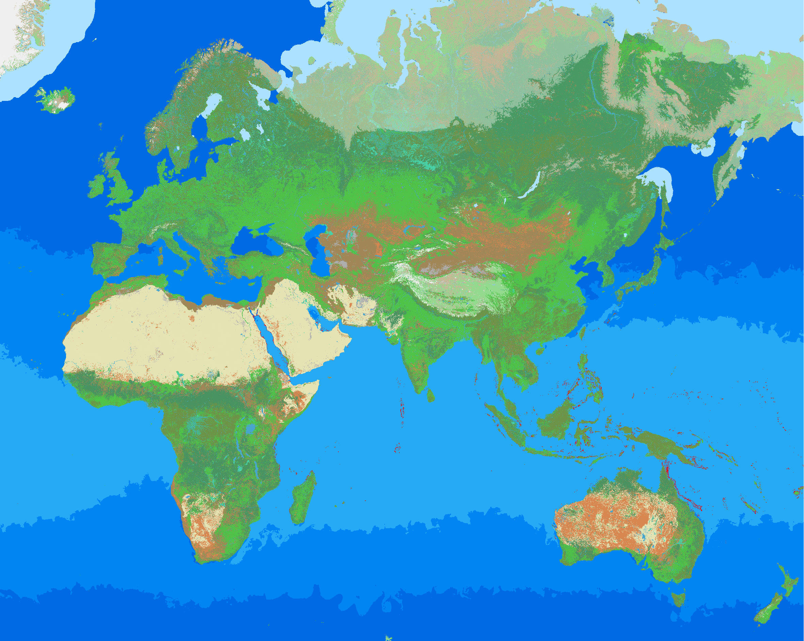

# Towny

<figure><figcaption>
The current Disc Realms Towny map as of Season 1 – Europe, Africa, Asia, and Oceania
</figcaption></figure>

## Gamemode Information

#### History and Background

Disc Realms Towny was suggested by a real-life friend of Lupancham, the owner of Disc Realms Studio. They proposed that we launch a new Towny server featuring our unique blend of gameplay elements. Many existing Towny servers lack depth and purpose beyond simply owning a town or nation on an Earth map. Unlike Semi-Anarchy, this gamemode does not have a predecessor, making it a fresh addition to the Towny experience.

**Development:** Towny was scheduled for development by Disc Realms Studios in late August 2025, with an initial release date set for October 4, 2025. During this period, Disc Realms Studios faced numerous challenges, including map failures, datapack issues, and promotional setbacks, among others. At one point, the studio even considered abandoning the project due to a total loss of $1,231 incurred from Towny (the server was later temporarily repurposed to host Semi-Anarchy). Despite these significant obstacles, we persevered and made every effort to create the best possible Towny server for our players.
